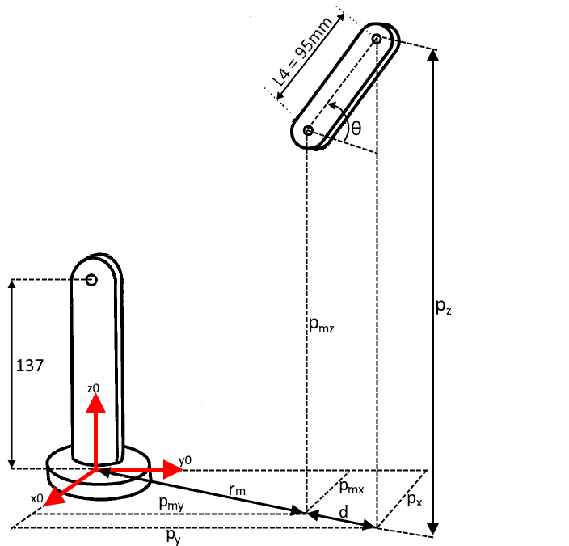
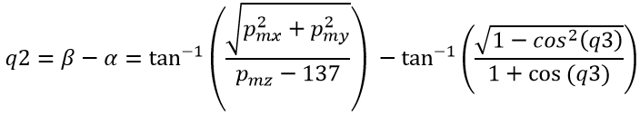
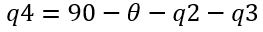
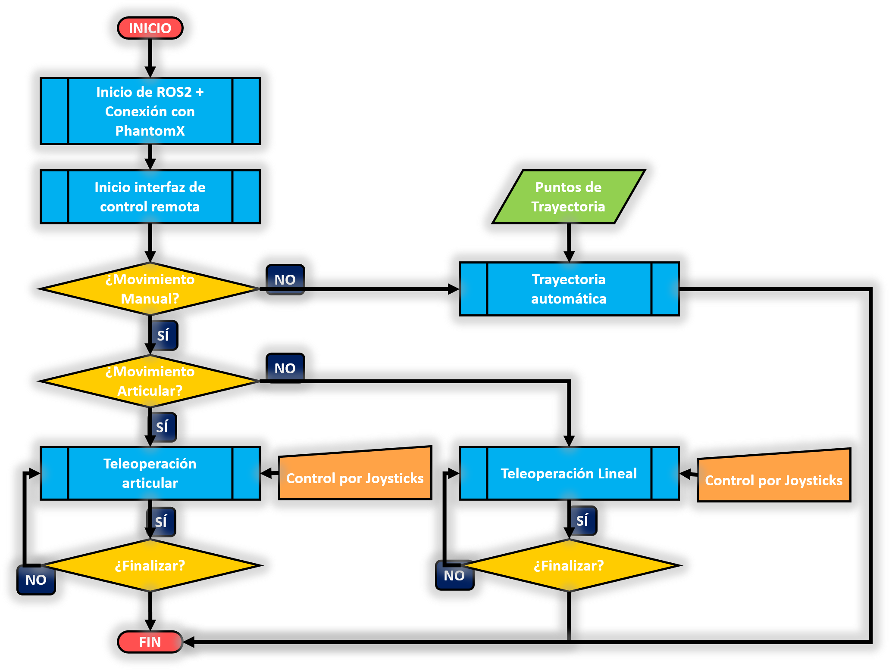
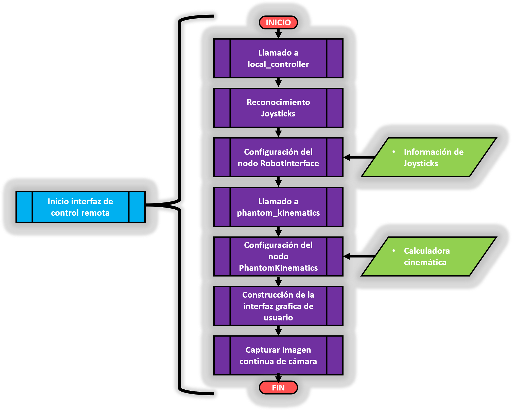
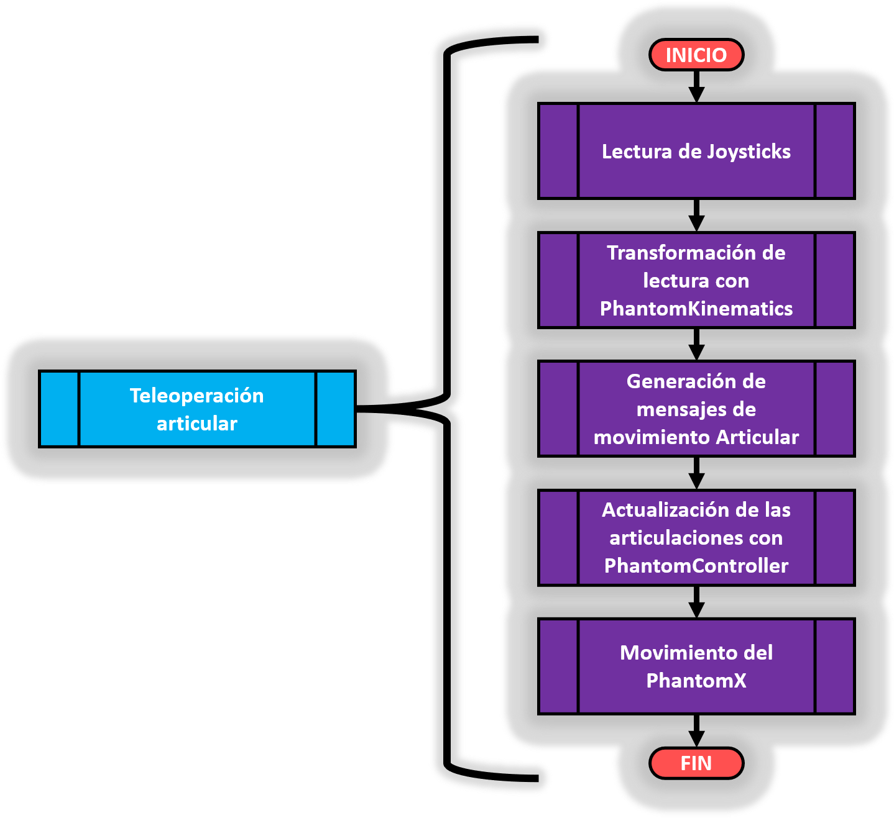
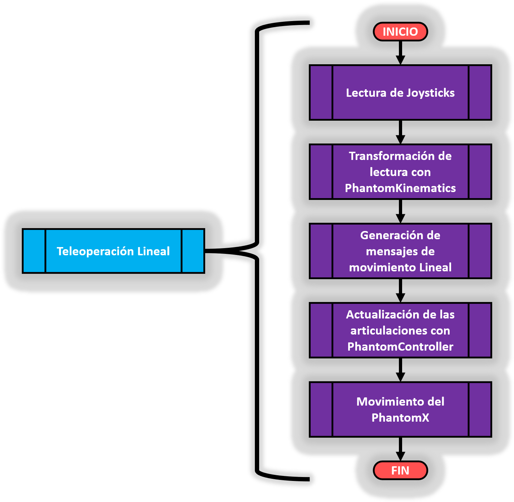
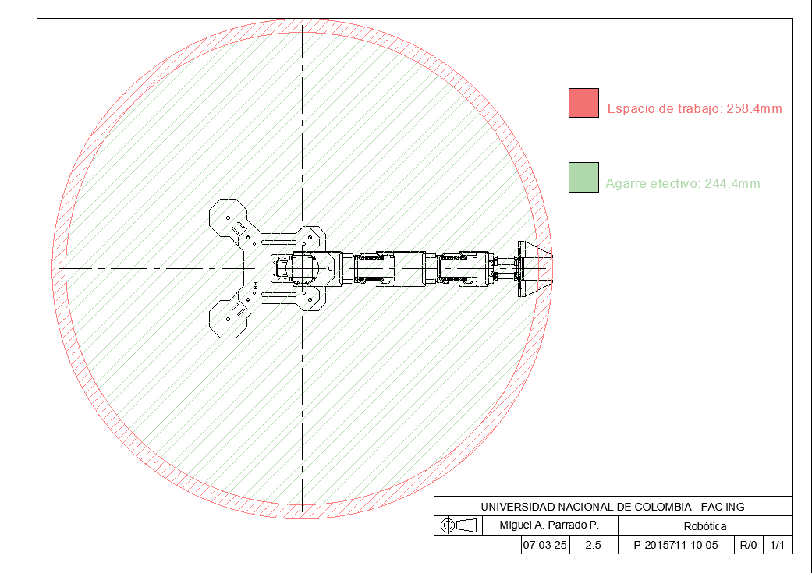

<br />
<div align="center">
  <a href="https://github.com/Danmunozbe/Practica1/tree/Pain2">
    
  </a>

  <h3 align="center">PROYECTO DE ROBÓTICA: TELEOPERACIÓN DEL ROBOT PHANTOM X PINCHER</h3>

  <p align="center">Robótica [2016770]
    <br />Andres Y. Romero D. · Luis E. Carmona A. · Miguel A. Parrado P.
    <br /> ayromerod@unal.edu.co · lucarmonaa@unal.edu.co · mparradop@unal.edu.co
  </p>
</div>


### 1. CÁLCULO DE LA CINEMÁTICA DIRECTA:

El primer paso que se realizó, para poder desarrollar la cinemática directa del Robot PhantomX Pincher, fue determinar la posición home del mismo (todas las articulaciones en cero) y tomar las medidas de cada uno de sus eslabones. En la siguiente imagen se puede observar esta información:

<p align="center">
  
</p>

El marco de referencia "base" se puso en el piso y el "TCP" se puso 15 mm antes del extremo del robot, en el punto de agarre óptimo de la pinza.

Posterior a ello, se realizó el diagrama del robót para poder dibujar los sistemas de referencia de cada eslabón siguiendo las reglas del algoritmo de Denavit-Hartenberg. Este proceso se ilustra en la siguiente figura:

<p align="center">
  
</p>

Observe que hay un sistema de referencia "noa" adicional a los exigidos por el algoritmo de Denavit-Hartenberg. Esto se debe a que, para que la pinza cumpla el estandar "noa", es necesario realizar una rotación adicional sobre el último sistema de referencia de Denavit-Hartenberg. Sin embargo, este último sistema de referencia "noa", al no hacer parte del algoritmo de Denavit-Hartenberg, no hará parte de la lista de los parametros DH. Teniendo en cuenta esto, a partir de la imagen anterior, es posible obtener los parametros de DH como se muestra a continuación:

<p align="center">
  
</p>

Teniendo en cuenta el cuadro anterior, se definen las matrices de DH y se encuentra la matriz de transformación homogenea que define la pose de "noa" respecto al sistema base. Este proceso fue realizado implementando una función en Matlab, la cual se muestra a continuación:

```matlab
function T = getDir(q) %T es la matriz de transformación que relaciona al sistema "noa" con el sistema "base" y "q" es el vector de valores articulares [q1 q2 q3 q4] en grados
    
    q = deg2rad(q); %se convierten los valores articulares a radianes
    
    % Matriz A
    A = [cos(q(1)), 0, -sin(q(1)), 0;
         sin(q(1)), 0,  cos(q(1)), 0;
         0,       -1,       0,   137;
         0,        0,       0,     1];
    
    % Matriz B
    B = [ sin(q(2)),  cos(q(2)), 0,  105*sin(q(2));
         -cos(q(2)),  sin(q(2)), 0, -105*cos(q(2));
          0,          0,        1,  0;
          0,          0,        0,  1];
    
    % Matriz C
    C = [cos(q(3)), -sin(q(3)), 0,  105*cos(q(3));
         sin(q(3)),  cos(q(3)), 0,  105*sin(q(3));
         0,         0,         1,  0;
         0,         0,         0,  1];
    
    % Matriz D
    D = [cos(q(4)), -sin(q(4)), 0,  95*cos(q(4));
         sin(q(4)),  cos(q(4)), 0,  95*sin(q(4));
         0,         0,         1,  0;
         0,         0,         0,  1];
    
    % Matriz E
    E = [0,  0,  1,  0;
        -1,  0,  0,  0;
         0, -1,  0,  0;
         0,  0,  0,  1];
    
    T = A*B*C*D*E;
end
```

Observe que la matriz E no es una matriz de DH. Despúes de realizar el alrgoritmo de DH, la matriz E se multiplica con la matriz de transformación homogenea del sistema 4 respecto a la base, para que de ese modo, las coordenadas del efector final cumplan con el estandar "noa".

A modo de ilustración se va a calcular usando Matlab, la pose del efector final "noa" con un conjunto de valores articulares arbitrarios, como por ejemplo [15, 30, 45, 60]. La orientación se convierte a ángulos de euler ZYZ para comparar más adelante.

```matlab
>> T = getDir([15 30 45 60])

T =

    0.6830    0.2588    0.6830  213.5636
    0.1830   -0.9659    0.1830   57.2242
    0.7071         0   -0.7071  187.9335
         0         0         0    1.0000


>> orientacionEuler = tr2eul(T)

orientacionEuler =

   15.0000  135.0000 -180.0000
```

El anterior resultado nos dice que, con esos valores articulares, el efector final "noa" se encontrará en la posición [x y z] = [213.56, 57.22, 187.93] con orientación [φ θ ψ] = [15, 135,  -180]. Para comprobar si este resultado es correcto, se hace uso del ToolBox de Peter Corke para graficar el robot, como se muestra a continuación:

```matlab
%Esta parte del código comprueba la cinemática inversa
ws = [-70 80 -70 80 -20 70]*8;     %se define el espacio de trabajo
plot_options = {'workspace',ws,'scale',0.5,'view',[-125 125],'tilesize',2,'ortho','lightpos',[2 2 10],'floorlevel',0,'jvec'};   %se define la configuración del gráfico
L(1) = Link('revolute','alpha',-pi/2,'a',0,'d',137,'offset',0,'qlim',[-pi pi]);         %se definen cada eslabón con los parámetros DH
L(2) = Link('revolute','alpha',0,'a',105,'d',0,'offset',-pi/2,'qlim',[-pi pi]);
L(3) = Link('revolute','alpha',0,'a',105,'d',0,'offset',0,'qlim',[-pi pi]);
L(4) = Link('revolute','alpha',0,'a',95,'d',0,'offset',0,'qlim',[-pi pi]);
pincher = SerialLink(L,'name','Pincher','plotopt',plot_options);                        %se define el robot
pincher.tool = [0 0 1 0;0 1 0 0;-1 0 0 0;0 0 0 1]*[0 1 0 0;-1 0 0 0;0 0 1 0;0 0 0 1];   %se modifica el TCP para que cumpla el estandar "noa"  
pincher.teach(q,'eul');          %se grafica el robot
hold on
trplot(eye(4),'frame','0','length',60,'thick',1);    %se grafica el sistema base
```
El resultado de la ejecución del anterior código, se muestra en la imagen siguiente:

<p align="center">
  
</p>

Como se puede observar en la imagen anterior, tanto la posición como la orientación obtenidos con las funciones del ToolBox de Peter Corke, coinciden con los resultados de nuestro propio algoritmo, comprobando la validez de nuestro proceso.

Finalmente se convierte la función de cinemática directa a lenguaje python para poder ser utilizada con ROS:

```python
def calc_robot_pose(q):

        """
        Calcula la cinemática directa de un robot pincher dado un vector de valores articulares [q1 q2 q3 q4].
        Args:
            q (list): Lista de 4 elementos que representan los ángulos de cada articulación del robot.
        Returns:
            list: Matriz de transformación homogenea que representa la pose del robot.
        """

    A = [[math.cos(math.radians(q[0])), 0, -math.sin(math.radians(q[0])), 0],
         [math.sin(math.radians(q[0])), 0, math.cos(math.radians(q[0])), 0],
         [0, -1, 0, 137],
         [0, 0, 0, 1]]
    
    B = [[math.sin(math.radians(q[1])), math.cos(math.radians(q[1])), 0, 105*math.sin(math.radians(q[1]))],
         [-math.cos(math.radians(q[1])), math.sin(math.radians(q[1])), 0, -105*math.cos(math.radians(q[1]))],
         [0, 0, 1, 0],
         [0, 0, 0, 1]]
    
    C = [[math.cos(math.radians(q[2])), -math.sin(math.radians(q[2])), 0, 105*math.cos(math.radians(q[2]))],
         [math.sin(math.radians(q[2])), math.cos(math.radians(q[2])), 0, 105*math.sin(math.radians(q[2]))],
         [0, 0, 1, 0],
         [0, 0, 0, 1]]
    
    D = [[math.cos(math.radians(q[3])), -math.sin(math.radians(q[3])), 0, 95*math.cos(math.radians(q[3]))],
         [math.sin(math.radians(q[3])), math.cos(math.radians(q[3])), 0, 95*math.sin(math.radians(q[3]))],
         [0, 0, 1, 0],
         [0, 0, 0, 1]]
    
    E = [[0, 0, 1, 0],
         [-1, 0, 0, 0],
         [0, -1, 0, 0],
         [0, 0, 0, 1]]
    
    # Convertir las listas en matrices de NumPy para la multiplicación
    A, B, C, D, E = np.array(A), np.array(B), np.array(C), np.array(D), np.array(E)
    
    # Multiplicación de las cinco matrices
    resultado = A @ B @ C @ D @ E
    
    return resultado
```

### 2. CINEMÁTICA INVERSA:

Para el cálculo de la cinemática inversa, se considera la pose final del robot con 4 argumantos: [px, py, pz, θ]. En donde px, py y pz son las coordenadas del efector final segun el marco de referencia del mundo (ubicado en la base del robot, alineado con la articulación 1) y θ el ángulo de la muñeca respecto al plano XY. Para el cálculo de q1, nos basamos en la siguiente imagen:

<p align="center">
  
</p>

Ayudados por la imagen anterior, se puede ver que q1 es el ángulo que se forma en el plano XY, y se calcularía como: 

<p align="center">
  
</p>

Donde pmx y pmy son las coordenadas **_x_**  e **_y_** de la muñeca. Aunque no se conocen todavia ni pmx ni pmy, sí sabemos que los últimos 3 eslabones están embebidos en un plano vertical definido por la línea rm, y por lo tanto:

<p align="center">
  
</p>

Entonces podemos deducir que:

<p align="center">
  
</p>

Ya conociendo a q1, ahora si podemos calcular las coordenadas de la muñeca pmx, pmy y pmz. Para hacerlo, nos basamos en la siguiente imagen, en la cual solo se ha dibujado el ángulo de inclinación θ de la muñeca, y el primer y último eslabón: L1 = 137mm y L4 = 95mm respectivamente.

<p align="center">
  
</p>

Ayudados con esta imagen, podemos ver que:

<p align="center">
  
</p>

Y por lo tanto, las coordenadas de la muñéca son:

<p align="center">
  
</p>

Para q2 y q3, se vé que el robot forma un codo con los eslabones L2 y L3. La siguiente imagen muestra un esquema de este codo:

<p align="center">
  
</p>

Aplicando la ley del coseno con los eslabones L2 = 105 y L3 = 105, y despejando a cos(q3) obtenemos:

<p align="center">
  
</p>

Por lo tanto la articulación q3 sería:

<p align="center">
  
</p>

Ya con q3 calculado, haciendo un análisis geometrico podemos calcular a los ángulos α y β cuya dierencia β - α es igual al ángulo q2, como se muestra en la ecuación siguiente:

<p align="center">
  
</p>

Y finalmente, ya conociendo a q2 y q3, el ángulo q4 queda de la siguiente manera:

<p align="center">
  
</p>

Este proceso fue implementado en una función de Matlab como se muestra a continuación: 

```matlab
function q = getInv(p)
    x=p(1);
    y=p(2);
    z=p(3); 
    v=[x;y;z-137];
    theta=90-atan2d(norm(cross([0;0;1],v)),dot([0;0;1],v)); %angulo entre el vector director en dirección z y el vector que va desde la articulación 2 al TCP
    q(1)=atan2d(y,x);
    r=95*cosd(theta);
    pmx=x-r*cosd(q(1));
    pmy=y-r*sind(q(1));
    if (x*pmx <= 0) && (y*pmy <= 0)
        rm = -sqrt(pmx^2 + pmy^2);
    else
        rm = sqrt(pmx^2 + pmy^2);
    end
    pmz = z-95*sind(theta);
    cos_q3 = (pmx^2 + pmy^2 + (pmz-137)^2 - 22050)/22050;
    q(3) = atan2d(sqrt(1-cos_q3^2),cos_q3);
    q(2) = atan2d(rm,pmz-137)-atan2d(105*sqrt(1-cos_q3^2),105*(1+cos_q3));
    q(4) = 90-theta-q(2)-q(3);
    q(5) = 0;  %apertura y cierre de la pinza
end
```

A modo de ilustración se va a calcular usando Matlab, las coordenadas articulares [q1 q2 q3 q4 q5] (q5 no hace parte de la cinemática inversa, sino que es arbitrario y corresponde a la apertura y cierre de la pinza), con un determinado valor de pose, como por ejemplo [px, py, pz, θ] = [150, 200, 200, 60]:

```matlab
>> q = getInv([150, 200, 300, 60])

q =

   53.1301   81.0504   28.7724  -79.8228         0
```
Y para comprobar nuestra implementación, se grafica al robot usando el Toolbox con estos ángulos q = [q1 q2 q3 q4] obtenidos, y se verifica si la pose mostrada en la gráfica corresponde a la introducida en nuestra función de cinemática inversa ([px, py, pz, θ] = [150, 200, 200, 60]):

```matlab
%Esta parte del código comprueba la cinemática inversa
ws = [-70 80 -70 80 -20 70]*8;
plot_options = {'workspace',ws,'scale',0.5,'view',[-125 125],'tilesize',2,'ortho','lightpos',[2 2 10],'floorlevel',0,'jvec'};
L(1) = Link('revolute','alpha',-pi/2,'a',0,'d',137,'offset',0,'qlim',[-pi pi]);
L(2) = Link('revolute','alpha',0,'a',105,'d',0,'offset',-pi/2,'qlim',[-pi pi]);
L(3) = Link('revolute','alpha',0,'a',105,'d',0,'offset',0,'qlim',[-pi pi]);
L(4) = Link('revolute','alpha',0,'a',95,'d',0,'offset',0,'qlim',[-pi pi]);
pincher = SerialLink(L,'name','Pincher','plotopt',plot_options);
pincher.tool = [0 0 1 0;0 1 0 0;-1 0 0 0;0 0 0 1]*[0 1 0 0;-1 0 0 0;0 0 1 0;0 0 0 1];
q = [deg2rad(q(1)) deg2rad(q(2)) deg2rad(q(3)) deg2rad(q(4))];
pincher.teach(q,'eul');
hold on
trplot(eye(4),'frame','0','length',60,'thick',1);
```
Y el resultado obtenido se muestra en la siguiente imagen:

<p align="center">
  
</p>

Como se puede apreciar en esta imagen, efectivamente la pose introducida en nuestra función es la misma graficada por el ToolBox de Peter Corke, comprobando el correcto funcionamiento de nuestro algoritmo.

Finalmente se convierte la función de cinemática inversa a lenguaje python para poder ser utilizada con ROS:

```python
   def calc_robot_joints(pose):
        """
        Calcula la cinemática inversa de un robot pincher dado un vector de posición.
        Args:
            pose (list): Lista de 4 elementos que representan la posición del efector final del robot.
        Returns:
            list: Lista de 4 elementos que representan los ángulos de las articulaciones en grados.
        """

        q1 = math.atan2(pose[1], pose[0])
        r = 95*math.cos(math.radians(pose[3]))
        pmx = pose[0] - r*math.cos(q1)
        pmy = pose[1] - r*math.sin(q1)
        if pose[0]*pmx <= 0 and pose[1]*pmy <= 0:
            rm = -math.sqrt(pmx**2 + pmy**2)
        else:
            rm = math.sqrt(pmx**2 + pmy**2)
        pmz = pose[2] - 95*math.sin(math.radians(pose[3]))
        cos_q3 = (pmx**2 + pmy**2 + (pmz-137)**2 - 22050)/22050
        q3 = math.atan2(math.sqrt(1-cos_q3**2),cos_q3)
        q2 = math.atan2(rm,pmz-137) - math.atan2(105*math.sqrt(1-cos_q3**2),105*(1+cos_q3))
        q4 = 90 - pose[3] - math.degrees(q2) - math.degrees(q3)

        resultado = [q1, q2, q3, math.radians(q4)]

        for i in range(len(resultado)):
            resultado[i] = math.degrees(resultado[i])

        return resultado
```

### 3. DIAGRÁMA DE FLUJO:

Se presenta el flujograma general del proyecto:

<p align="center">
  
</p>

En las siguientes imágenes, se desglozan los procesos de color azul, y se muestra su flujograma interno

<p align="center">
  
</p>

<p align="center">
  
</p>

<p align="center">
  
</p>

<p align="center">
  
</p>

<p align="center">
  
</p>


### 4. PLANO DE PLANTA Y TELEOPERACIÓN:
Para este plano, se consideró un modo reducido de el espacio de trabajo del Phantom X Pincher, en donde la articulación 2 configura al brazo de tal manera que queda paralelo con el suelo. En este espacio de trabajo reducido, se observa que el robot tiene un alcance efectivo de 305mm a 300° de la redonda.

<p align="center">
  
</p>

Teniendo en cuenta lo anterior, se desarrollaron los programas de teleopereaciones; tanto manual como automátática, que permiten que el robot se mueva sin problemas dentro de la región limitada por el plano de planta.

Para la teleoperación, se configuran dos espacios de trabajo, uno local y otro remoto; ambos con ROS2. 

El espacio remoto es quien lee las señales de los joysticks y las traduce a mensajes que posteriormente recibe e interpreta el espacio local. Por medio de una interfaz, este espacio puede cambiar el modo de movimiento entre automático y manual, de este ultimo pudiendo elegir entre movimiento articular y lineal. Además; este tambien recive la información visual de la cámara de el espacio local, para permitir confirmación visual al teleoperador.

El espacio local, es quien recibe las instrucciones del espacio remoto y las traduce con ayuda de la libreria de DynamixelSDK al movimiento del PhantomX Pincher. Este espacio posee una cámara, y envia su informacion visual de regreso al espacio remoto, para permitir una retroalimentación visal con el teleoperador. El espacio local manda al robot tres tipos de movimientos.

* Movimiento Articular: El espacio local recive movimientos en el espacio de las articulaciones, que se lleva a los motores del PhantomX. Este movimiento articular esta restringido para todos los motores, ya que ninguno de estos puede girar más de 150° en ambas direcciones.

* Movimiento Lineal: Este movimiento es calculado desde el espacio remoto; y siendo que el robot tiene solamente 4 grados de libertad, además de no tener muñeca articulada, el movimiento lineal no mantiene la orientación del efector final, y solamente asegura mover el TCP en líneas rectas.

* Movimiento Automático: El movimiento automático es una trayectoria posteriormente programada, que al momento de ser ejecutada no permite que el teleoperador retome el control del robot, hasta que se finalize el movimiento.

### 5. DISCUCIÓN DEL CÓDIGO:


### 6. TELEOPERACIÓN MANUAL VS OPERACIÓN AUTOMÁTICA:


### 7. VIDEOS:

